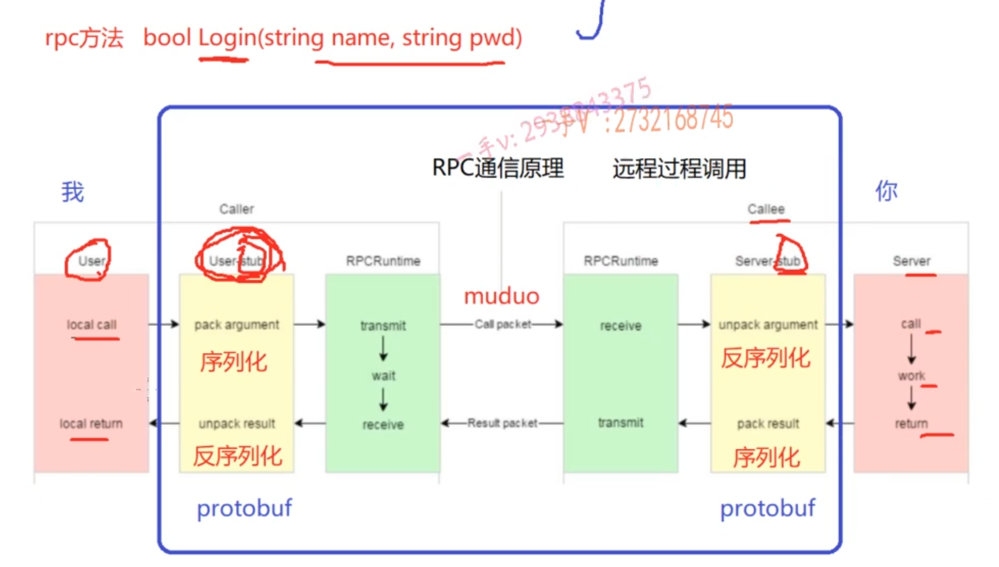

# Mprpc_project 一个分布式网路通信框架

## 集群 : 每一台服务器独立运行一个工程的所有模块
## 分布式 : 一个工程拆分了很多模块, 每一个模块独立部署运行在一个服务器主机上, 所有服务器协同工作共同提供服务, 每一台服务器称作分布式的一个节点, 根据节点的并发要求, 对一个节点可以再做节点模块集群部署

## 单机版服务器瓶颈:
1. 受限于硬件资源, 聊天服务器所能承受的用户并发量不够
2. 任意模块的修改, 都会导致整个项目代码重新编译, 部署
3. 系统中,有些模块属于CPU密集型(计算量很大)-> 部署在CPU好的机器上, 有些模块属于I/O密集型(经常接收网络IO, 输入输出)-> 需要带宽好, 造成各模块对于硬件资源的需求是不一样的

## 集群服务器, 集群中的每一台服务器都独立运行一套系统
1. 用户并发量提升了
2. 类似后台管理这样的模块, 不需要高并发
3. 项目代码还是需要整体重新编译, 而且需要进行多次部署

## 分布式服务器 : 所有服务器共同构成一个聊天系统, 
1. 大系统的软件模块怎么划分? -> 可能会实现大量重复代码                              \  rpc
2. 各模块之间如何访问?  机器一上的模块怎么调用机器2上的模块的一个业务方法?           /

## protobuf =>> json
1. protobuf二进制存储; xml和json都是文本存储
2. protobuf不需要存储额外的信息

## 项目文件结构
1. ./bin 可执行文件
2. ./build CMake 构建编译项目文件
3. ./examle 使用框架的服务消费者, 框架的使用实例代码
4. ./lib 库文件
5. ./src 源代码
6. ./test 测试

## 提供静态库的方式(因为muduo是静态库), 动态库编译不成功

### static成员变量
静态成员变量必须在类内声明, 在类外初始化

## 程序梳理
服务的提供方会首先通过RpcProvider类注册服务对象和服务方法, 然后RpcProvider会用unordered_map表记录下来, RpcProvider启动之后, 相当于启动了一个Epoll+多线程的服务器; 启动了之后就可以接收远程的连接, 远程有新连接之后, moduo会调用RpcProvider::OnConnection; 如果远程有message, 会调用RpcProvider::Onmessage(), 会从数据头中解析出request参数, response由业务函数填, 然后业务函数执行回调函数发送回去 =>> SendRpcResponse()

### 单例模式
在单例模式中， 只有一个对象，类的设计旨在确保一个类只有一个实例，并提供一个全局的访问点来获取该实例。删除拷贝构造函数是为了防止通过拷贝构造函数创建类的多个实例，从而违反了单例模式的初衷

### zookeeper客户端常用命令
ls :  罗列当前指定目录节点
get :  查看目录节点内容
create : 创建节点
set : 修改节点的值
delete : 删除节点

### zookeeper的watcher机制
用Service_name + method_name 作为一个路径查找zookeeper中这个节点是否存在判断服务是否存在 : 用路径管理znode节点
事件回调机制.  
Zookeeper提供了分布式数据的发布/订阅功能，可以让客户端订阅某个节点，当节点发生变化 (比如创建、修改、删除、数据获取、子节点获取)时，可以通知所有的订阅者。 另外还可以为客户端连接对象注册监听器，可以监听到连接时的状态。

黄色部分: 设计rpc方法参数的打包和解析, 也就是数据的序列化和反序列化, 使用protobuf

绿色部分: 网络部分, 包括寻找rpc服务主机, 发起rpc调用请求和响应rpc调用结果,使用muduo网络库和zookeeper服务配置中心